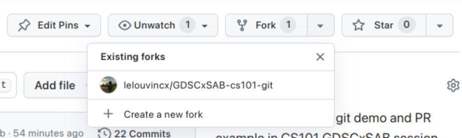

# Intro to Git and GitHub

#### If you don't have git on your machine, [install it](https://help.github.com/articles/set-up-git/).

## Fork the repository



Firstly fork the repository to your repositorie.
Now clone the forked repository to your machine. Go to your GitHub 
account, open the forked repository, click on the code button and then 
click the _copy to clipboard_ icon.

Open a terminal and run the following git command:

```bash
git clone "url you just copied"
```

where "url you just copied" (without the quotation marks) is the url to 
this repository (your fork of this project). See the previous steps to 
obtain the url.


> [!IMPORTANT]
> You should choose SSH for ease of your work. If you are using HTTPS, you should provide your GitHub username and Github token every time you push or pull from the repository.


## How to edit the `public/attendees.json` file

Open the `public/attendees.json` file in a text editor, and add a new block like this:

```json
  {
    "name": "Your Name",
    "gdsc": "Your School (Abbreviated)",
    "website": "https://example.com",
    "linkedin": "https://linkedin.com/xx/xxx",
    "facebook": "https://facebook.com/xxx",
    "twitter": "Your Twitter Username",
    "github": "Your Github Username",
    "instagram": "Your Instagram Username"
  }
```

> [!IMPORTANT]
> The field `name` and `gdsc` are required. The other fields are optional. You can remove them if you don't have them.

> [!NOTE]
> Make sure to add a comma at the end of the previous block to separate the new block from the previous one.

Now commit those changes using the `git commit` command:

```
git commit -m "Add your-name to Contributors list"
```

replacing `your-name` with your name.

## Push changes to GitHub

Push your changes using the command `git push`:

```
git push origin -u your-branch-name
```

replacing `your-branch-name` with the name of the branch you created 
earlier.

<details>
<summary> <strong>If you get any errors while pushing, click 
here:</strong> </summary>

- ### Authentication Error
     <pre>remote: Support for password authentication was removed on 
August 13, 2021. Please use a personal access token instead.
  remote: Please see 
https://github.blog/2020-12-15-token-authentication-requirements-for-git-operations/ 
for more information.
  fatal: Authentication failed for 
'https://github.com/<your-username>/first-contributions.git/'</pre>
  Go to [GitHub's 
tutorial](https://docs.github.com/en/authentication/connecting-to-github-with-ssh/adding-a-new-ssh-key-to-your-github-account) 
on generating and configuring an SSH key to your account.

</details>

## Submit your changes for review

If you go to your repository on GitHub, you'll see a `Compare & pull request` button. Click on that button.

> [!IMPORTANT]
> If you don't see the `Compare & pull request` button, please click on the button `Create Pull Request` and choose the correct source and target branches.


Now submit the pull request.


Soon we'll be merging all your changes into the main branch of this project. And your name will be added to the list of contributors.

## Contributors
